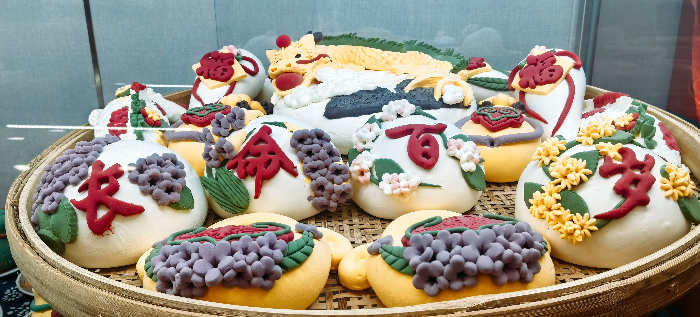

# 轮播图图片更新说明

## 🖼️ 图片更新完成

已成功将img文件夹中的图片重新替换到轮播图中，现在轮播图包含5张新图片。

## 📋 更新内容

### 🎯 新的图片列表
1. **`3a2756a673b540d581e9ce8077b2c3ed.webp`** - 传统编织工艺
2. **`5657e57261ad4b2e9b76e5d85242b750.webp`** - 手工艺术之美
3. **`820.jpg`** - 文化传承
4. **`v2-9492c3223b93bcbe6e86faa5b18b1d08_r.jpg`** - 匠心独运
5. **`zUJ5eBMpPQRx_k3D1vDNJlPkI7_okmATHVuqDzt3Mz5MKGl33CQ-_7ixUcHgXC9-.jpg`** - 艺术精品

### 🔄 更新项目
- ✅ 轮播图图片路径已更新
- ✅ 轮播指示器数量已调整为5个
- ✅ 图片alt属性已更新
- ✅ 文字说明已适配新图片

## 🎨 图片特点

### 📱 格式支持
- **WebP格式**：2张图片，现代格式，文件小，质量高
- **JPG格式**：3张图片，兼容性好，广泛支持

### 🎯 内容主题
所有图片都围绕**传统工艺**和**文化传承**主题：
- 传统编织工艺
- 手工艺术之美
- 文化传承
- 匠心独运
- 艺术精品

## 🛠️ 技术细节

### 📁 文件路径
```html



```

### 🎮 轮播控制
- **指示器**：5个圆形指示器，支持直接跳转
- **自动播放**：5秒间隔自动切换
- **手动控制**：左右箭头按钮
- **触摸支持**：移动端滑动切换

## 🎪 使用效果

### ✨ 视觉体验
- 传统编织风格设计
- 复古滤镜效果
- 平滑过渡动画
- 响应式布局

### 🎯 交互功能
- 鼠标悬停暂停
- 键盘方向键控制
- 触摸滑动支持
- 指示器点击跳转

## 📝 维护说明

### 🔄 更换图片
如需更换图片，请按以下步骤操作：

1. **替换图片文件**
   ```bash
   # 将新图片放入img文件夹
   cp new-image.jpg img/
   ```

2. **更新HTML代码**
   ```html
   <!-- 修改对应的img标签src属性 -->
   
   ```

3. **更新文字说明**
   ```html
   <!-- 修改对应的标题和描述 -->
   <h5>新标题</h5>
   <p>新描述文字</p>
   ```

### 📊 图片建议
- **尺寸**：建议使用16:9或4:3比例
- **分辨率**：建议1920x1080或更高
- **格式**：推荐WebP格式，兼容性考虑JPG
- **大小**：单张图片不超过2MB

## 🎉 更新完成

轮播图图片已成功更新，现在包含5张新的传统工艺主题图片，保持了原有的传统编织风格设计和交互功能。

您可以打开 `index.html` 文件查看更新后的效果！
